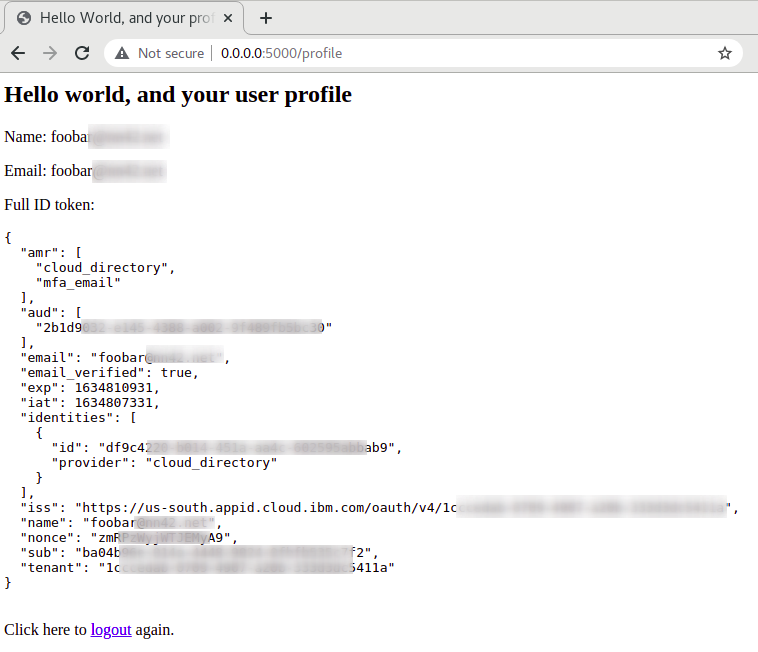

# Putting IBM App ID, Flask, and openID Connect together
A small, cut-down Flask app which demonstrates configuration, login, ID token access and logout.

Code flow:
- An instance of IBM App ID is configured as identity provider for OIDC.
- When the app starts, it serves an index page (Hello world). A hyperlink leads to the login page.
  
- When not yet logged in, the Flask OIDC client redirects to App ID for authentication.
  
- After successful authentication, the login page redirects to a protected profile page. There, details of the ID token are shown.
  
- A link on the profile page leads to a logout action. The logout clears all cookies and tokens and redirects to the index page.